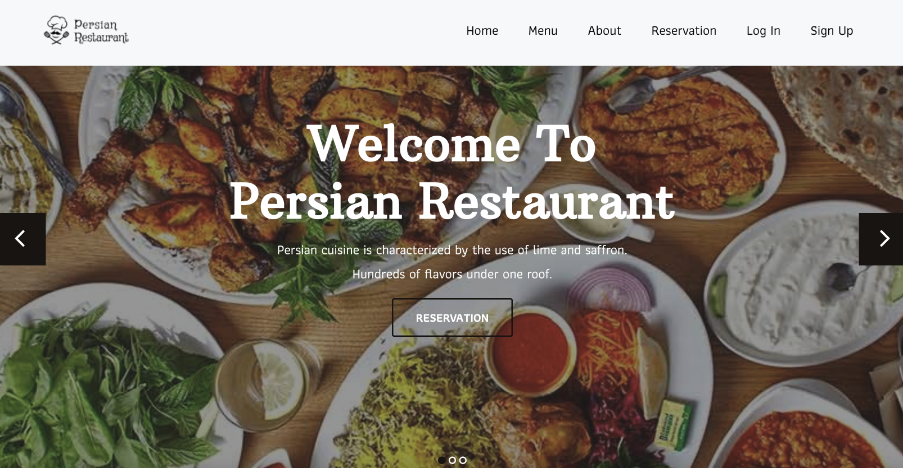

# Django Restaurant Website

Welcome to the Django Restaurant Website! This project allows users to view menus, add food items to the menu, make reservations, and manage user authentication.

## Introduction

The Django Restaurant Website is a web application built with Django that provides features for managing restaurant menus, accepting reservations, and handling user authentication.

## Features

- View Menus: Browse through the restaurant's menu items.
- Add Food to Menu: Admin users can add, update, and delete food items.
- Make Reservations: Users can make reservations for a specific date and time.
- User Authentication: Users can register, log in, and log out.

## Technologies Used

- Django
- Python
- Bootstrap
- HTML
- CSS
- JavaScript

## license
This project is licensed under the MIT License.

